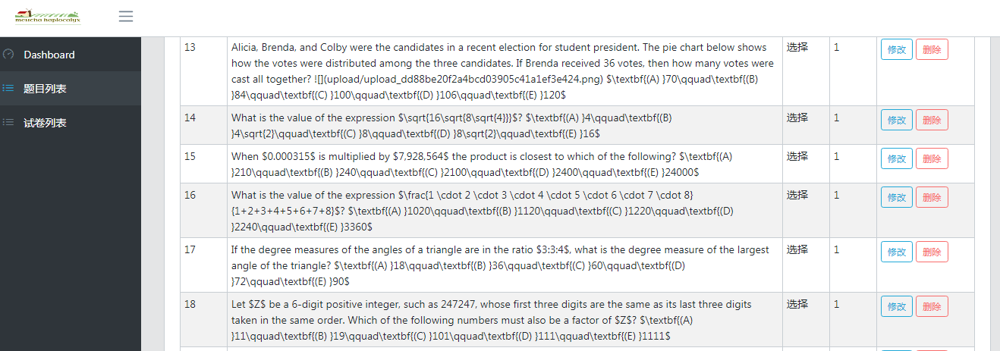

# 简单题库系统
> 一个基于MARKDOWN的简单的题库系统，完成的模块包括：
+ 题目的增删改查
+ 手工组卷
+ 试卷的增删改查
+ 简单的Dashboard




## 安装

```
git clone https://github.com/lelf2005/exam.git
npm install
```
## 启动
```
npm start
```
在浏览器中访问 http://localhost:3000，
创建一个账号，然后登陆，系统现在没有做权限控制。


